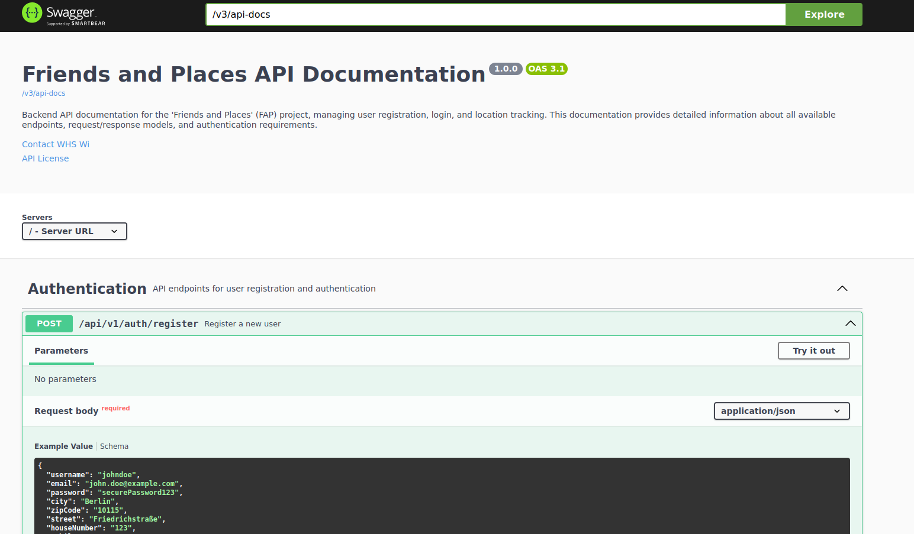

# API Documentation Guide

## Overview

The Friends and Places API provides a comprehensive RESTful interface for user registration, authentication, and location tracking. This document explains how to access and navigate the interactive API documentation built with OpenAPI (Swagger).

## What is OpenAPI/Swagger?

OpenAPI (formerly known as Swagger) is a specification for documenting REST APIs. The Swagger UI provides an interactive interface that allows users to:

- Browse all available API endpoints
- See detailed information about request parameters and response models
- Test API endpoints directly from the browser
- Understand possible error responses and status codes

## Accessing the API Documentation

The API documentation is accessible through a web interface that is automatically generated based on the codebase.

### URL

Once the application is running, you can access the API documentation at:

```
http://localhost:8080/swagger-ui/index.html
```

No authentication is required to view the documentation, making it easy to explore the API capabilities.

## Navigating the Documentation

### 1. API Overview

When you first open the Swagger UI, you'll see an overview of all available API endpoints grouped by controllers (e.g., Authentication, Users, Locations).

*Note: To help others understand the interface, consider adding a screenshot of your Swagger UI here showing the main page with expanded Authentication endpoints.*



### 2. Endpoint Details

Click on any endpoint to expand it and see detailed information:

- **Description**: What the endpoint does
- **Parameters**: Required and optional parameters
- **Request Body**: Structure of the data you need to send (for POST/PUT requests)
- **Responses**: Possible response status codes and data structures
- **Authorization**: Whether authentication is required

### 3. Testing Endpoints

Each endpoint has a "Try it out" button that allows you to:

1. Enter parameter values
2. Provide request body content (for POST/PUT requests)
3. Execute the request against the running API
4. See the actual response, including status code and body

### 4. Understanding Models

At the bottom of the page, you'll find the "Schemas" section that provides detailed information about all data models used in the API, including:

- User
- UserRegisterDTO
- UserLoginDTO 
- ApiError (for error responses)

## Error Handling

The API uses standardized error responses for all endpoints. When an error occurs, the response will include:

- HTTP status code (e.g., 400, 401, 404, 409, 500)
- Error message describing what went wrong
- Additional details to help troubleshoot the issue

For example, when a user tries to register with an email that's already in use, you'll receive a 409 Conflict response with details about the conflict.

### Standard Error Response Format

```json
{
  "path": "/api/v1/auth/register",
  "message": "User with email 'test@example.com' already exists",
  "statusCode": 409,
  "statusName": "Conflict",
  "timestamp": "2025-06-06T14:30:45.123",
  "errorType": "CONFLICT"
}
```

## Authentication

Many API endpoints require authentication using JSON Web Tokens (JWT):

1. First, register a user or login to obtain a JWT token
2. For subsequent requests to protected endpoints, include the token in the Authorization header:
   - Format: `Bearer {your-token}`

In the Swagger UI, you can click the "Authorize" button at the top of the page to enter your token, which will then be automatically included in all API requests you make through the UI.

## API Versioning

The API uses versioning in the URL path (e.g., `/api/v1/auth/register`). This ensures backward compatibility as the API evolves.

## Additional Resources

- [Spring Boot Documentation](https://docs.spring.io/spring-boot/docs/current/reference/html/)
- [OpenAPI Specification](https://swagger.io/specification/)
- [JWT Authentication](https://jwt.io/introduction/)

## Legal Information

This API documentation is generated using [Springdoc OpenAPI](https://springdoc.org/), which is based on the [OpenAPI Specification](https://swagger.io/specification/) (formerly Swagger). Both are licensed under the Apache License 2.0.
